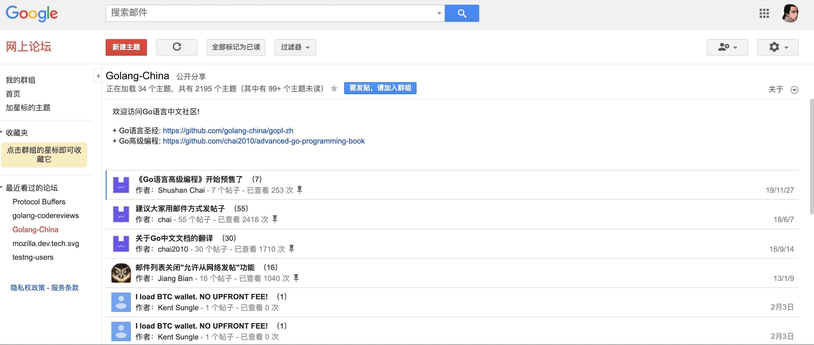
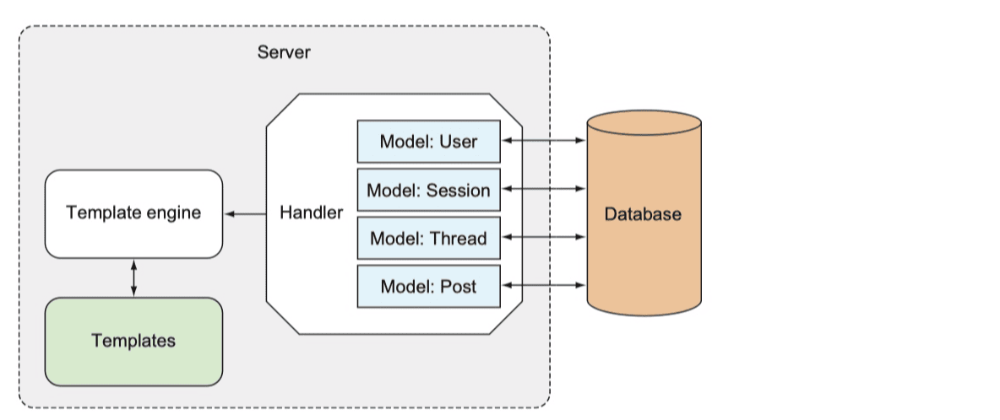

在线论坛
----

https://laravelacademy.org/post/21519

ARChitchat

## 1 整体设计与数据模型



这个在线论坛需要具备用户认证功能（注册、登录、退出等），认证后的用户才能创建新的群组、以及在群组中发表主题，访客用户访问论坛首页可以查看群组列表，进入指定群组页面可以查看对应的主题信息。


### 技术方案


> 注：上图中 Client 代表客户端发起请求的用户，虚框内是部署在服务器已启动的在线论坛应用，Multiplexer 代表路由器（比如 `gorilla/mux` ），Handler 代码处理器/处理器方法，数据库操作位于处理器方法中，Templates 代表最终展示给用户的经过模板引擎编译过的视图模板。


### 数据模型

- 用户（User）
- 群组（Thread）
- 主题（Post）


在本项目开发时，会把用户会话（Session）也存储到数据库，所以需要一个额外的会话模型，此外，为了简化应用，我们不会真的像 Google 网上论坛那样对用户做权限管理，整个应用只包含一种用户类型，并且具备所有操作权限：




## 2 通过模型类与MySQL数据库交互


```sh
go mod init github.com/andyron/architchat
```


```sql
create table users (
  id         serial primary key,
  uuid       varchar(64) not null unique,
  name       varchar(255),
  email      varchar(255) not null unique,
  password   varchar(255) not null,
  created_at timestamp not null
);
    
create table sessions (
  id         serial primary key,
  uuid       varchar(64) not null unique,
  email      varchar(255),
  user_id    integer references users(id),
  created_at timestamp not null
);
    
create table threads (
  id         serial primary key,
  uuid       varchar(64) not null unique,
  topic      text,
  user_id    integer references users(id),
  created_at timestamp not null
);
    
create table posts (
  id         serial primary key,
  uuid       varchar(64) not null unique,
  body       text,
  user_id    integer references users(id),
  thread_id  integer references threads(id),
  created_at timestamp not null
);
```


```
go get github.com/go-sql-driver/mysql
```


## 3 访问论坛首页


## 4 通过 Cookie + Session 实现用户认证

### 编写全局辅助函数


## 5 创建群组和主题功能实现


## 6 日志和错误处理


## 7 通过单例模式获取全局配置


## 8 消息、视图和日期时间本地化


```sh
go get -u github.com/nicksnyder/go-i18n/v2/i18n
go get -u github.com/nicksnyder/go-i18n/v2/goi18n
```

### 消息本地化


### 视图本地化


### 日期时间本地化


## 9 部署 Go Web 应用


## 10 通过 Viper 读取配置文件并实现热加载


