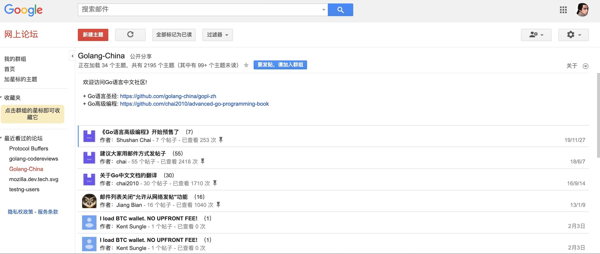
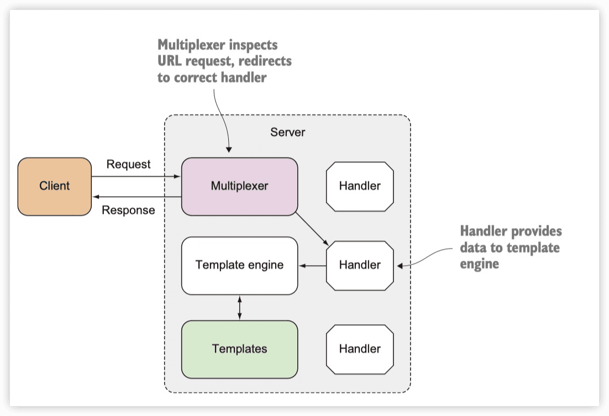
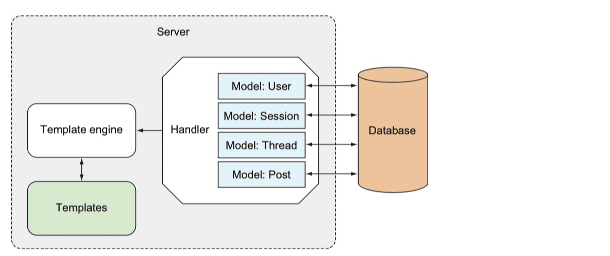
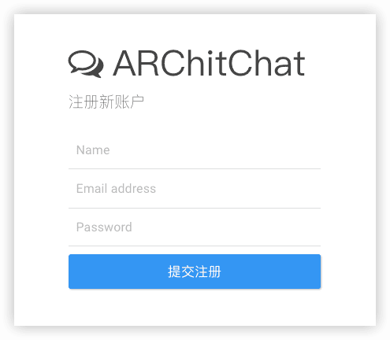
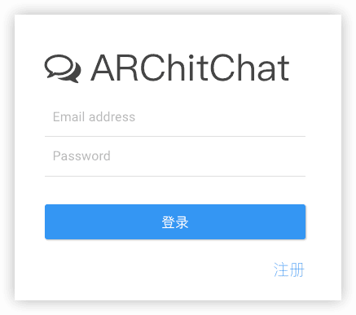

在线论坛
----

参考：https://laravelacademy.org/post/21519

ARChitchat，基于Go语言构建在线论坛。

使用的库：

- 路由库 [gorilla/mux](https://github.com/gorilla/mux)
- 与mysql交互的包 [go-mysql-driver/mysql](https://github.com/go-sql-driver/mysql) 
- 本地化  [nicksnyder/go-i18n](https://github.com/nicksnyder/go-i18n)

## 1 整体设计与数据模型

仿照google网上论坛：



这个在线论坛需要具备用户认证功能（注册、登录、退出等），认证后的用户才能创建新的群组、以及在群组中发表主题，访客用户访问论坛首页可以查看群组列表，进入指定群组页面可以查看对应的主题信息。


### 技术方案



Client 代表客户端发起请求的用户，虚框内是部署在服务器已启动的在线论坛应用，Multiplexer 代表路由器（比如 [gorilla/mux](https://github.com/gorilla/mux) ），Handler 代码处理器/处理器方法，数据库操作位于处理器方法中，Templates 代表最终展示给用户的经过模板引擎编译过的视图模板。

Go Web项目开发时，类似PHP项目部署，按照上面的MVC架构基于业务流程编写代码，最后将测试过的应用代码编译打包，部署到远程服务器（这样才能被普通用户访问），并启动该应用，等待客户端请求，这样就完成了整个应用开发流程。

不同的地方，Go Web项目因为静态语言和实现机制的缘故不需要借助类似 php-fpm、nginx 这种额外的HTTP服务器、反向代理服务器，Go应用**以单文件形式部**署，静态资源和视图模板的部署与传统动态语言不一样等。

### 数据模型

- 用户（User）
- 群组（Thread）
- 主题（Post）


在本项目开发时，会把用户会话（Session）也存储到数据库，所以需要一个额外的会话模型，此外，为了简化应用，不会真的像Google网上论坛那样对用户做权限管理，整个应用只包含一种用户类型，并且具备所有操作权限：




## 2 通过模型类与MySQL数据库交互

### 2.1 项目初始化

目录/文件的作用介：

- `main.go`：应用入口文件
- `config.json`：全局配置文件
- `handlers`：用于存放处理器代码（可类比为 MVC 模式中的控制器目录）
- `logs`：用于存放日志文件
- `models`：用于存放与数据库交互的模型类
- `public`：用于存放前端资源文件，比如图片、CSS、JavaScript 等
- `routes`：用于存放路由文件和路由器实现代码
- `views`：用于存放视图模板文件


```sh
go mod init github.com/andyron/architchat
```


### 2.2 创建数据表

```sql
create table users (
  id         serial primary key,
  uuid       varchar(64) not null unique,
  name       varchar(255),
  email      varchar(255) not null unique,
  password   varchar(255) not null,
  created_at timestamp not null
);
    
create table sessions (
  id         serial primary key,
  uuid       varchar(64) not null unique,
  email      varchar(255),
  user_id    integer references users(id),
  created_at timestamp not null
);
    
create table threads (
  id         serial primary key,
  uuid       varchar(64) not null unique,
  topic      text,
  user_id    integer references users(id),
  created_at timestamp not null
);
    
create table posts (
  id         serial primary key,
  uuid       varchar(64) not null unique,
  body       text,
  user_id    integer references users(id),
  thread_id  integer references threads(id),
  created_at timestamp not null
);
```


### 2.3 与数据库交互

#### 数据库驱动

第三方包 [go-mysql-driver](https://github.com/go-sql-driver/mysql) 

```sh
go get github.com/go-sql-driver/mysql
```

#### 数据库连接


#### 用户相关模型类🔖


#### 主题相关模型类


### 小结

上述模型类中，模型类与数据表是如何映射的呢？这个由 `go-mysql-driver` 底层实现，每次从数据库查询到结果之后，可以通过 `Scan` 方法将数据表字段值映射到对应的结构体模型类，而将模型类保存到数据库时，又可以基于字段映射关系将结构体属性值转化为对应的数据表字段值。


## 3 访问论坛首页

用户请求的处理流程：

1. 客户端发送请求；
2. 服务端路由器（multiplexer）将请求分发给指定处理器（handler）；
3. 处理器处理请求，完成对应的业务逻辑；
4. 处理器调用模板引擎生成HTML并将响应返回给客户端。

### 3.1 定义路由器

基于[gorilla/mux](https://github.com/gorilla/mux)来实现路由器：

```sh
go get github.com/gorilla/mux
```

仿照Laravel框架对Go路由处理器代码进行拆分


### 3.2 启动HTTP服务器


> ```go
> 	. "github.com/andyron/architchat/routes"
> 
> 	_ "github.com/go-sql-driver/mysql"
> ```
>
>  `.` 别名，通过这种方式引入的包可以直接调用包中对外可见的变量、方法和结构体，而不需要加上包名前缀。
>
>  `_` 别名，只会调用该包里定义的 `init` 方法。🔖
>
> ```go
> // go-sql-driver/mysql driver.go
> func init() {  // 上面的`-`，就调用这个init方法把mysql的驱动引入了
> 	if driverName != "" {
> 		sql.Register(driverName, &MySQLDriver{})
> 	}
> }
> ```


### 3.3 处理静态资源

```go
	// 处理静态资源文件
	// 初始化文件服务器和目录为当前目录下的 public 目录
	assets := http.FileServer(http.Dir(config.App.Static))
	// 指定静态资源路由及处理逻辑：将 /static/ 前缀的 URL 请求去除 static 前缀，然后在文件服务器查找指定文件路径是否存在（public 目录下的相对地址）。
	r.PathPrefix("/static/").Handler(http.StripPrefix("/static/", assets))
```


### 3.4 编写处理器实现

#### 首页处理器方法


#### 创建视图模板

使用 Go 自带的 `html/template` 作为模板引擎

主布局文件 `layout.html`

顶部导航模板 `navbar.html`

首页视图模板 `index.html`


引入多个视图模板是为了提高模板代码的复用性，因为对于同一个应用的不同页面来说，可能基本布局、页面顶部导航和页面底部组件都是一样的。

#### 渲染视图模板

从数据库查询群组数据并将该数据传递到模板文件，最后将模板视图渲染出来

```go
// 生成HTML
func generateHTML(writer http.ResponseWriter, data interface{}, filenames ...string) {
	...

	threads, err := models.Threads();
  if err == nil {
      templates.ExecuteTemplate(w, "layout", threads)
  }
}
```

编译多个视图模板时，默认以第一个模板名作为最终视图模板名，所以这里第二个参数传入的是 `layout`，第三个参数传入要渲染的数据 `threads`，对应的渲染逻辑位于 `views/index.html` 中：

```html
    {{ range . }}
      <div class="panel panel-default">
        <div class="panel-heading">
          <span class="lead"> <i class="fa fa-comment-o"></i> {{ .Topic }}</span>
        </div>
        <div class="panel-body">
          由 {{ .User.Name }} 创建于 {{ .CreatedAt | fdate }} - 已有 {{ .NumReplies }} 个主题。
          <div class="pull-right">
            <a href="/thread/read?id={{.Uuid }}">阅读更多</a>
          </div>
        </div>
      </div>
    {{ end }}
```

其中 `{{ range . }}` 表示将处理器方法传入的变量，这里是 `threads` 进行循环。

#### 注册首页路由


### 3.5 访问论坛首页


```sh
$ go run main.go
2024/05/30 01:35:09 Starting HTTP service at 0.0.0.0:8080
```


## 4 通过Cookie + Session实现用户认证

### 4.1 编写全局辅助函数

`handlers/helper.go`

```go
// 通过Cookie判断用户是否已登录
func session(w http.ResponseWriter, r *http.Request) (sess models.Session, err error) {
	cookie, err := r.Cookie("_cookie")
	if err != nil {
		sess = models.Session{Uuid: cookie.Value}
		if ok, _ := sess.Check(); !ok {
			err = errors.New("Invalid session")
		}
	}
	return
}
```

在 `session` 函数中，通过从请求中获取指定 Cookie 字段里面存放的 Session ID，然后从 Session 存储器（这里存储驱动是数据库）查询对应 Session 是否存在来判断用户是否已认证，如果已认证则返回的 `sess` 不为空。


### 4.2 用户认证相关处理器


#### 用户注册

用户注册的逻辑是填写注册表单（`Signup` 处理器方法），提交注册按钮将用户信息保存到数据库（`SignupAccount` 处理器方法）。

#### 用户登录

接下来，服务端会将用户重定向到登录页面（`Login` 处理器方法），用户填写登录表单后，就可以通过 `Authenticate` 处理器方法执行认证操作。


#### 用户退出


### 4.3 用户认证相关视图模板

`login.html` 登录页面

`signup.html` 注册页面

`auth.layout.html` 登录和注册页面的单独布局模板 

### 4.4 注册用户认证路由


### 测试用户认证功能

用户注册页面 `http://localhost:8080/signup`:



登录页面 `http://localhost:8080/login`：



## 5 创建群组和主题功能实现

### 5.1 群组的创建和浏览

#### 处理器方法


定义了三个方法，分别用于渲染群组创建表单页面、处理提交表单执行群组创建逻辑、以及根据指定 ID 渲染对应群组页面。前两个方法需要认证后才能访问，否则将用户重定向到登录页，群组详情页不需要认证即可访问，不过会根据是否认证返回不同的视图模板。


#### 视图模板


#### 注册路由


#### 测试群组创建和浏览


### 5.2 创建新主题

#### 处理器方法


#### 注册路由


#### 测试主题创建


## 6 日志和错误处理

### 日志处理

#### 初始化日志处理器

#### 定义日志函数

#### 重构业务代码

业务处理器中，将原来的日志打印代码都重构为调用对应的日志函数。


### 错误处理

Go 语言并没有像 PHP、Java 那样提供异常这种类型，只有 `error` 和 `panic`，对于 Go Web 应用中的错误处理，不影响程序继续往后执行的，可以通过日志方式记录下来，如果某些错误导致程序无法往后执行，比如浏览群组详情页，对应群组不存在，这个时候，我们就应该直接返回 404 响应或者将用户重定向到 404 页面，而不能继续往后执行，对于这种错误，只能通过单独的处理逻辑进行处理，这种错误类似于 Laravel 中的中断异常处理。

#### 重定向到错误页面

#### 编写错误页面相关代码

#### 重构业务代码


### 整体测试


## 7 通过单例模式获取全局配置


## 8 消息、视图和日期时间本地化🔖

### 消息本地化

```sh
go get -u github.com/nicksnyder/go-i18n/v2/i18n
go get -u github.com/nicksnyder/go-i18n/v2/goi18n
```

### 


### 视图本地化


### 日期时间本地化


## 9 部署Go Web应用 🔖


## 10 通过Viper读取配置文件并实现热加载


----

> 需要完善或bug
>
> - [ ] 登出 cook
> - [ ] 创建群组user_id没有
> - [ ] 6~10


